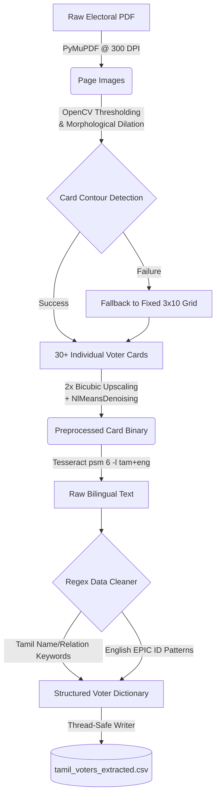

# 🗳️ Tamil Nadu Electoral Roll OCR Extraction Pipeline


A robust, highly scalable, parallel OCR pipeline built to extract structured voter data directly from multi-page Tamil Nadu Electoral Roll PDFs (ECI format). This solution uses dynamic layout-aware contour segmentation paired with powerful bilingual (Tamil + English) Tesseract OCR engines to guarantee incredibly high accuracy without manual cropping.

---

## 📌 Features

- 🔍 **Bilingual OCR** — Built-in support for mixed Tamil + English extraction out of the box using Tesseract `tam+eng`.
- ⚡ **Multi-Threaded Performance** — Implements `ThreadPoolExecutor` and `ProcessPoolExecutor` for fully parallel, blazing-fast batch PDF processing.
- 📐 **Adaptive Box Segmentation** — Leverages pure OpenCV morphological operations to dynamically identify individual voter card grids (falls back to a calculated mathematical grid if bounds are unclear).
- 📄 **Zero-Dependency PDF Parsing** — Utilizes `PyMuPDF` (fitz) at High-Res 300 DPI (does NOT require complex Poppler installations on Windows!).
- 🧹 **Advanced NLP Regex Parsing** — Highly tuned heuristics map unstructured Tamil strings into exactly 8 clean columns: `serial_number`, `epic_id`, `name`, `relation_type`, `relation_name`, `house_number`, `age`, and `gender`.
- 💽 **Crash-Resistant Checkpointing** — Automatically reads the output CSV to skip already processed files if interrupted, saving hours of computation.

---

## 🏗️ System Architecture



---

## 📂 Project Structure

```text
OCR-Election-2026/
│
├── tamil_ocr_pipeline.py            # Primary robust Tamil OCR pipeline (Recommended)
├── tesseract_extractor.py           # Strict Tesseract English numeric extractor 
├── easyocr_extractor.py             # Alternative EasyOCR standalone engine
│
├── electoral_ocr_pipeline/          # Modular hybrid architecture mapping
│   ├── main.py                      
│   ├── pdf_processor.py             
│   ├── image_segmentation.py        
│   ├── ocr_engine.py                
│   └── data_cleaner.py              
│
├── requirements.txt                 # Dependency map
└── README.md                        # Project documentation (You are here!)
```

---

## 🚀 Getting Started

### Prerequisites

1. **Python 3.10+**
2. **Tesseract OCR (With Tamil Language Data)**
   - Download the Windows installer from [UB-Mannheim/tesseract](https://github.com/UB-Mannheim/tesseract/wiki)
   - **Important:** During installation, under "Additional Language Data", make sure you check the box for **Tamil**.
   - Install to the default path: `C:\Program Files\Tesseract-OCR\`

### Installation

Clone the repository and install the standard dependencies:

```bash
pip install PyMuPDF>=1.23.0 opencv-python>=4.8.0 pytesseract numpy pandas pillow
```

*(Alternatively, run `pip install -r requirements.txt`)*

### Running the Pipeline

Place your ECI Electoral Roll PDFs inside your target directory. For the main, highly-stable single-file Tamil OCR Pipeline, run:

```bash
# To test the pipeline quickly on just the first 2 PDFs:
python tamil_ocr_pipeline.py --test

# To process a specific target PDF:
python tamil_ocr_pipeline.py --file "119-eroll/2026-EROLLGEN-S22-119-SIR-DraftRoll-Revision1-TAM-1-WI.pdf"

# To run a full concurrent batch process across all files in the directory:
python tamil_ocr_pipeline.py --workers 4
```

The output will automatically be consolidated safely via thread-locks into `tamil_voters_extracted.csv`.

---

## 📥 Output Schema

The CSV generated utilizes strict column headers for easy database insertion or Pandas Dataframe manipulation:

| Column          | Example Data                | Description                                |
|-----------------|-----------------------------|--------------------------------------------|
| `serial_number` | 24                          | Index on the local page                    |
| `epic_id`       | TJV1234567                  | Voter Identity Hash                        |
| `name`          | முத்துச்சாமி               | Extracted voter name                       |
| `relation_type` | Father                      | Mapped relationship constraint             |
| `relation_name` | கருப்பசாமி                | Extracted relation name                    |
| `house_number`  | 14/2A                       | Extracted alphanumeric door sequence       |
| `age`           | 45                          | Normalized integer mapped to age           |
| `gender`        | ஆண்                         | Gender (ஆண் = Male, பெண் = Female)         |
| `source_file`   | 2026-FC-EROLLGEN...pdf      | Traceability mapping back to the directory |
| `page_number`   | 14                          | Traceability mapping                       |

---

## 🔧 Pro Tips & Troubleshooting

> [!WARNING]
> **RAM Utilization (OOM Errors):**
> High DPI PyMuPDF processing across multiple threads consumes significant memory. If the script crashes silently without an error, edit the script or use the argument `--workers 2` to reduce memory constraints.

> [!TIP]
> **Tesseract Missing Path Error:**
> If you get a "tesseract is not installed or it's not in your PATH" error, ensure `pytesseract.pytesseract.tesseract_cmd = r'C:\Program Files\Tesseract-OCR\tesseract.exe'` inside `tamil_ocr_pipeline.py` correctly points to your executable.

---

## 📄 License & Compliance

Developed strictly for electoral data research, demographic testing, and analytics automation. Ensure your usage of extracted public data complies fully with applicable local privacy laws and Election Commission of India (ECI) guidelines.

---

## 👤 Author

**Mithun Barath M R**
- 📧 barathmithun1548@gmail.com
- 🔗 [LinkedIn](https://www.linkedin.com/in/mithunbarathmr13/)
- 🐙 [GitHub](https://github.com/mithunbarath)
- 📍 Tiruppur, India
